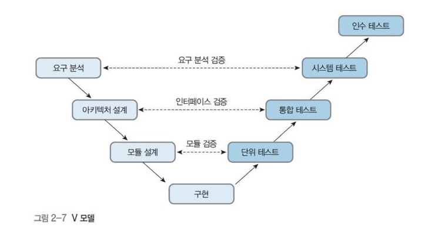
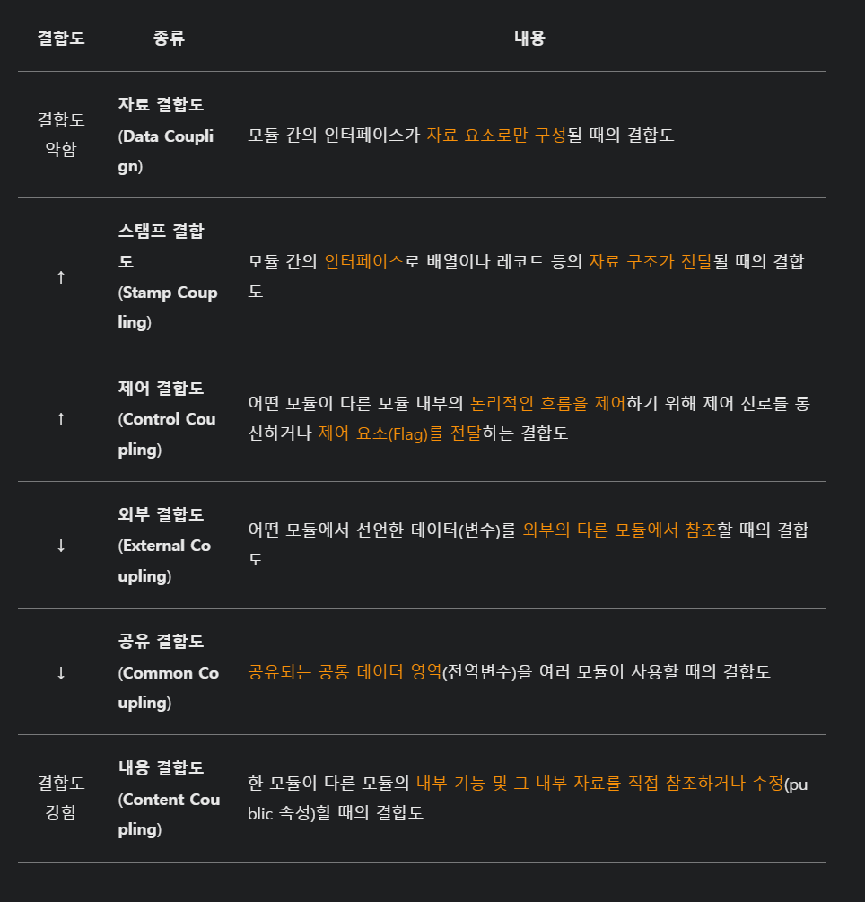
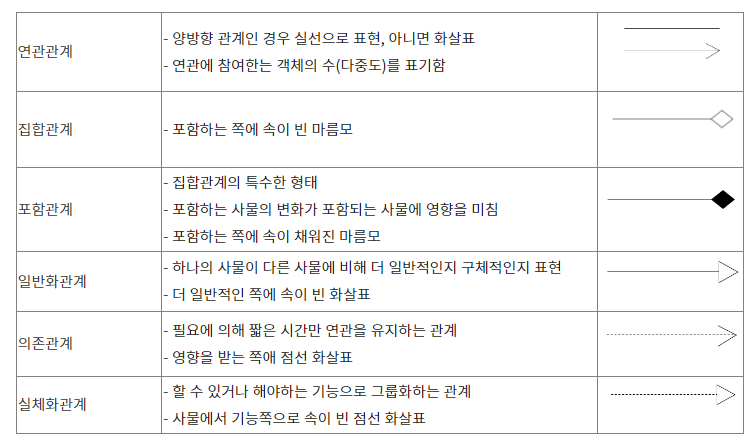
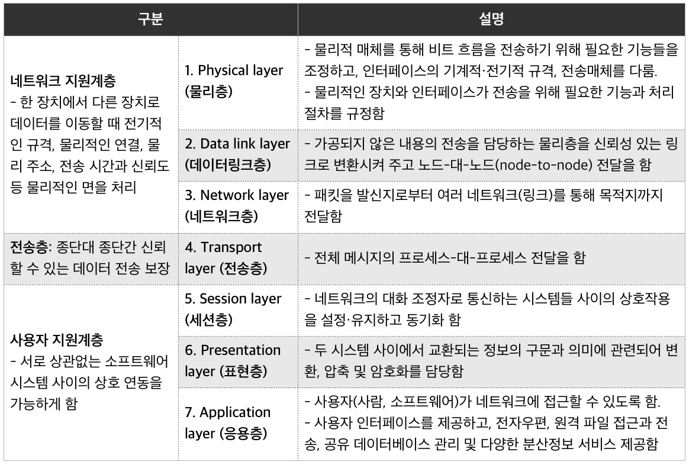
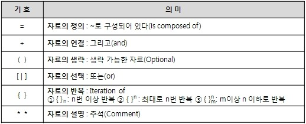
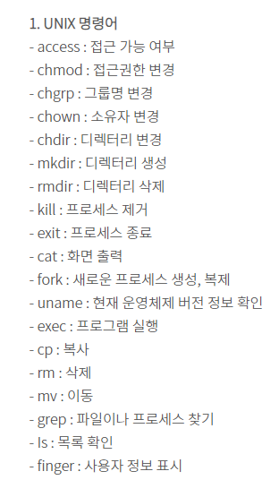
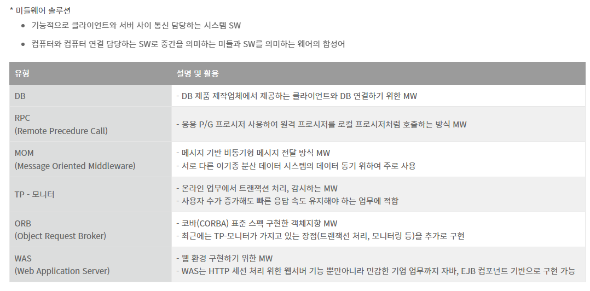

# 정보처리기사 실기 요약

|용어|정의|
|---|---|
|FCFS 스케줄링|비선점형으로	먼저 도착한 프로세스부터 처리하는 방식|
|SJF 스케줄링|비선점형으로 실행시간이 짧은 프로세스를 먼저 처리하는 방식|
|SRT 스케줄링|선점형으로	현재 실행중인 프로세스보다 남은 실행시간이 짧은 프로세스가 들어오면 실행중인 프로세스를 선점하고 짧은 실행시간을 가진 프로세스를 실행하는 방식|
|RR 스케줄링|선점형으로	각 프로세스에 일정한 시간 할당하고, 할당된 시간이 다 되면 다른 프로세스로 넘어가는 방식|
|Priority 스케줄링|선점형 또는 비선점형으로	우선순위를 기반으로 프로세스를 처리하는 방식. 우선순위는 정수값으로 표현되며, 작은 숫자일수록 우선순위가 높음|
|Multilevel Queue 스케줄링|프로세스를 여러 개의 큐로 나누어 우선순위를 다르게 부여하고, 각 큐마다 다른 스케줄링 알고리즘을 적용하는 방식|
|Multilevel Feedback Queue 스케줄링|알고리즘	프로세스를 여러 개의 큐로 나누어 우선순위를 다르게 부여하고, 프로세스의 특성에 따라 큐를 이동시키는 방식|

|용어|기호|정의|
|---|---|---|
|합집합|∪|두 개 이상의 집합 중에서 적어도 하나에 속하는 모든 원소로 이루어진 집합|
|교집합|∩|두 개 이상의 집합에 모두 속하는 원소로 이루어진 집합|
|차집합|\-|한 집합에서 다른 집합에 속하는 원소를 뺀 집합|
|카티션 프로덕트|×|두 집합 A와 B에 대해, A의 모든 원소와 B의 모든 원소를 순서쌍으로 묶은 집합|
|셀렉트|σ|조건을 만족하는 튜플만을 선택하는 연산|
|프로젝트|π|튜플에서 원하는 속성(열)만 선택하는 연산|
|조인|▷◁|두 개 이상의 테이블에서 공통으로 존재하는 속성을 기준으로 릴레이션을 합치는 연산|
|디비전|÷|릴레이션 R의 모든 속성에서 릴레이션 S의 속성을 나눈 나머지 속성을 가진 릴레이션을 만드는 연산|

**사회공학** 기술적이나 시스템적으로 행해지는 행위가 아닌 인위적으로 행해지는 방법, 사람의 심리를 이용하여 비기술적인 경로를 악용해서 정보를 수집하는 방법

**다크데이터** 정보를 수집한 후, 처리되지 않은 채 미래에 사용할 가능성이 있다는 이유로 삭제되지 않고 방치되어 있어, 저장 공간만 차지하고 심각한 보안 위험을 초래할 수 있는 데이터로 죽은 데이터를 의미

**SIEM** 보안정보관리와 보안이벤트관리를 통합한 시스템

**형상관리 도구** Git, CVS, SVN

**트러스트존** 프로세서안에 독립적인 보안 구역을 따로 두어 중요한 정보를 보호하는 하드웨어 기반 보안 기술

**타이포스쿼팅** URL 하이재킹이라고도 하며, 네티즌들이 사이트에 접속할 때 주소를 잘못 입력하는 실수를 이용하기 위해 유사한 유명 도메인을 미리 등록하는 것

**SSO** 단 한번의 시스템 인증을 통하여 여러 정보 시스템에 재인증 절차없이 접근할 수 있도록 하는 통합 로그인 솔루션

**UML구성요소** 사물, 관계, 다이어그램

**클래스 다이어그램** 시스템에서 사용되는 객체 타입을 정의하고 그들 간의 존재하는 정적인 관계를 표현

**UML 모델링 인터페이스** 클래스와 같은 기타 모델요소 또는 컴포넌트가 구현해야 하는 오퍼레이션 세트를 정의하는 모델 요소

|UML 다이어그램|종류|
|---|---|
|구조적 다이어그램|Class, Object, Component, Deployment, Compistie, Package|
|행위 다이어그램|Use Case, Sequence, State, Activity, Timing, Communication|

|용어|정의|
|---|---|
|개체집합|동일한 특성을 갖는 개체들의 모임|
|관계집합|개체집합과의 연결관계|
|관계집합의 속성|관계집합의 속성|
|실선|개체집합-관계집합 연결, 부분참여를 의미|
|점선|관계집합-관계집합의 속성 연결|

|용어|정의|
|---|---|
|관계해석|원하는 릴레이션을 정의하는 방법을 제공하며 비절차적인 언어|
|관계대수|원하는 정보와 그 정보를 검색하기 위해서 어떻게 유도하는가를 기술하는 절차적 언어|

|용어|정의|
|---|---|
|IDEA|DES를 대체하기 위해 스위스에서 개발한 알고리즘|
|SKIPJACK|미국 NAS가 개발한 Clipper칩에 내장되는 블록 알고리즘|
|DES|IBM이 개발하고 NBS에 의해 미국의 국가 표준으로 발표된 암호화 알고리즘|
|SEED|한국인터넷진흥원(KISA)에서 개발한 블록 암호화 알고리즘|
|AES|미국표준기술연구소(NIST)에서 발표한 개인키 암호화 알고리즘|
|ARIA|국가 정보원과산악연합회가 개발한 블록 암호화 알고리즘|
|RSA|MIT의 라이베스트, 샤미르, 애들먼에 의해 제안된 공개키 암호화 알고리즘, 소인수 분해 특성 이용|
|SHA|미국국가안보국(NSA)이 처음으로 설계 했으며, 미국 국가 표준으로 지정된 해시 암호화 알고리즘|
|MD5|128비트 암호화 해시 함수로, RFC 1321로 지정, 무결성 검사에 사용|
|HAS-160|국내 표준 전자서명 알고리즘인 KCDSA에 사용되는 160비트 암호학적 해시 함수|
|LFSR|현재 상태의 선형 연산을 통해 다음 상태를 생성하는 레지스터, XOR함수를 사용|
|RC4|평문 1바이트와 암호키 1바이트가 XOR 처리 되어 암호문 1바이트를 생성, 옥텟 단위 기반, 로널드 라이베스트가 제작|

**VPN** 인터넷을 통해 디바이스 간에 사설 네트워크 연결을 생성, 공중망에서 가상의 사설망을 구현하는 기술

|용어|정의|
|---|---|
|SRP|단일 책임의 원칙|객체는 하나의 책임만을 가짐|
|OCP|개방폐쇄 원칙|인터페이스는 확장에 열려있고, 수정에 닫혀있다|
|LSP|리스코프 대체 원칙|기반 클래스는 파생 클래스로 대체 가능|
|ISP|인터페이스 분리의 원칙|클라이언트가 분리되어 있으면, 인터페이스도 분리된 상태 클라이언트에 특화된 여러 개의 인터페이스가 하나의 범용 인터페이스보다 낫다|
|DIP|의존관계 역전의 원칙|클라이언트는 구체 클래스가 아닌 인터페이스에 의존|

**서브넷 마스크 계산 ( IP 주소가 139.127.19.132, 서브넷 마스크가 255.255.255.192 일 때 네트워크 주소, 호스트 개수 구하기 )** 
● 네트워크 주소는 IP주소와 서브넷 마스크를 AND 연산한 결과 => 139.127.19.128 
  10001011.01111111.00010011.10000100 (IP 주소) 
  11111111.11111111.11111111.11000000 (서브넷 마스크) 
  -------------------------------------------------------------- 
  10001011.01111111.00010011.10000000 (네트워크 주소)  
● 브로드캐스트 주소는 네트워크 주소에 서브넷 내의 모든 호스트 비트를 1로 설정한 것을 OR 연산한 결과 => 139.127.19.191 
  10001011.01111111.00010011.10000000 (네트워크 주소) 
  00000000.00000000.00000000.00111111 (호스트 부분) 
  -------------------------------------------------------------- 
  10001011.01111111.00010011.10111111 (브로드캐스트 주소)  
● 호스트 비트는 6개로, 호스트 비트를 모두 0으로 설정하면 첫 IP주소가 되고, 모두 1로 설정하면 마지막 IP 주소가 됨 
● 첫번째 주소와 마지막 IP주소는 네트워크 주소와 브로드캐스트 주소로 예약되어 있으므로 사용불가 
● 따라서 호스트 개수는 62개가 된다. (2^6 - 2)

**리그레션 테스트** 소프트웨어의 변경 코드에 대하여 확인하는 테스트, 변경된 부분의 새로운 오류를 확인하기 위해 이미 테스트했던 부분을 다시 실행해 보는 반복 테스트

|용어|정의|
|---|---|
|IGP|라우터로 상호 접속이 되어 있는 여러 개의 네트워크 집합으로 도메인 혹은 자치 시스템이라고 함|
|EGP|시스템 사이에 경로 설정 정보 등을 교환하기 위해 사용하는 프로토콜|
|OSPF|Link State Routing 기법을 사용, 인접 네트워크 정보를 이용|
|BGP|서로 다른 자율 시스템의 라우터 간에 라우팅 정보를 교환하는 데 사용되는 외부 게이트웨이 프로토콜|

|용어|영문|
|---|---|
|완전함수종속|Full Functional Dependency|
|부분함수종속|Partial Functional Dependency|
|이행함수종속|Transitive Functional Dependency|

|용어|정의|
|---|---|
|HTTP|World Wide Web을 위한 프로토콜로 요청과 응답 프로토콜로 구성된 프로토콜|
|Hypertext|웹상의 다른 문서나 멀티미디어 등으로 이동할 수 있도록 구조화되어 있는 텍스트|
|HTML|웹 페이지 표시를 위해 개발된 지배적인 마크업 언어|

**RAID 0** 디스크 스트라이핑 방식으로, 중복 저장과 오류 검출 및 교정을 위한 패리티비트가 없어 데이터의 복구가 불가능한 방식

|용어|정의|
|---|---|
|REDO|재실행|
|UNDO|변경 취소|
|COMMIT|연산 완료 반영|
|ROLLBACK|모든연산을 취소|

|용어|정의|
|---|---|
|삽입이상|자료를 삽입할 때 의도하지 않은 자료까지 삽입해야만 자료를 테이블에 추가가 가능한 현상|
|삭제이상|어떤 정보를 삭제하면, 의도하지 않은 다른 정보까지 삭제되어버리는 현상|
|갱신이상|중복된 데이터 중 일부만 수정되어 데이터 모순이 일어나는 현상| 

|용어|정의|
|---|---|
|extend|원래의 리스트에 지정한 리스트 추가|
|pop|마지막 요소 또는 지정한 요소 삭제 후 삭제한 값을 반환|
|reverse|항목을 역순으로 바꿈|

**TKIP** 무선랜을 위한 암호 표준으로 임시 키 무결성 프로토콜

|용어|정의|
|---|---|
|Static 분석 도구|소스코드의 실행없이 코드 자체만으로 코드를 분석하는 도구|
|Dynamic 분석 도구|프로그램을 실행하여 코드를 분석하는 도구|

|용어|정의|
|---|---|
|JUnit|Erich Gamma와 Kent Beck이 만든 오픈 소스 테스트 프레임워크로 자바 프로그래밍 언어용 유닛 테스트 프레임워크|
|xUnit|다양한 언어를 지원하는 단위테스트 프레임워크|

|용어|정의|종류|
|---|---|---|
|블랙박스 테스트|소프트웨어의 내부 구조나 작동 원리를 모르는 상태에서 소프트웨어의 동작을 검사하는 방법| Equivalence Partitioning, Boundary Value Analysis, Cause-Effect Graph|
|화이트박스 테스트|내부 소스 코드를 테스트하는 기법으로 사용자가 들여다 볼 수 없는 구간의 코드 단위를 테스트| Base Path Test, Condition Test, Loop Test, Data Flow Test|

|용어|정의|
|---|---|
|구문검증기준|최소 한 번은 모든 문장이 수행|
|결정검증기준|조건식이 참/거짓일 때 수행|
|조건검증기준|결정검증기준과 달리 조건식에 상관없이 개별 조건이 참/거짓일 때 수행|

**ISMS** 정보보호 관리 체계

|용어|정의|
|---|---|
|후보키| 튜플을 유일하게 식별하게 위해 사용하는 속성들의 부분집합  유일성( 하나의 키 값으로 하나의 튜플만을 유일하게 식별)과 최소성(식별하는데 꼭 필요한 속성으로만 구성) 만족|
|기본키|후보키 중에서 특별히 선정된 주키(Main Key)로 중복된 값을 가질 수 없음|
|대체키|기본키를 제외한 나머지 후보키|
|슈퍼키|유일성은 만족하지만 최소성은 만족하지 않는 키|
|외래키|다른 릴레이션의 기본키를 참조하는 속성|

|용어|정의|
|---|---|
|Authentication|주체의 신원을 검증하기 위한 증명 활동|
|Authorization|인증된 주체에게 접근을 허용하고 특정 업무를 수행할 권한을 부여하는 과정|
|Accounting|주체의 자원등에 대한 사용 정보를 수집|

**ARP 스푸핑** 스위칭 환경의 LAN상에서 패킷의 흐름을 바꾸는 공격 방법

**결합도(Coupling)** 결합도는 모듈 간에 상호 의존하는 정도 또는 두 모듈 사이의 연관 관계를 의미한다. 결합도가 약할수록 독립적인 모듈

**응집도(Cohesion)** 응집도는 명령어나 호출문 등의 모듈의 내부 요소들의 서로 관련있는 정도, 즉 모듈이 독립적인 기능으로 구성됐는지 정도를 의미한다. 응집도가 강할수록 독립적인 모듈
Cohesion](./Img/Cohesion.png)

**UML** 표준화한 객체지향 모델링 언어 [구성요소] - 사물 : 다이어그램 안에서 관계가 형성될 수 있는 대상 - 관계 : 사물과 사물 사이의 연관성 - 다이어그램 : 사물과 관계를 도형으로 표현한 것

|구조적 다이어그램|정의|
|---|---|
|클래스(Class)|클래스 사이의 관계를 표현|
|객체(Object)|객체 사이의 관계를 표현|
|컴포넌트(Component)|컴포넌트의 인터페이스나 관계를 표현, 구현단계|
|배치(Deployment)|물리적 위치를 표현, 구현단계|
|복합체 구조(Composite Structure)|복합 구조의 클래스와 컴포넌트 내부 구조를 표현|
|패키지(Package)|여러 모델 요소들을 그룹화해 패키지를 구성하고 관계를 표현|

|행위 다이어그램|정의|
|---|---|
|활동(Activity)|업무 처리 과정이나 연산이 수행되는 과정 표현|
|상태 머신(State Machine)|객체의 생명주기 표현|
|유스케이스(Use Case)|사용자 관점에서 시스템 행위를 표현|
|순차(Sequence)|시간의 흐름에 따른 객체 사이 상호작용 표현|
|상호작용 개요(Interaction Overview)|여러 상호작용 다이어그램 사이의 제어 흐름을 표현|
|통신(Communication)|객체 사이의 관계를 중심으로 상호작용을 표현|
|타이밍(Timing)|객체 상태 변화와 시간 제약을 명시적으로 표현|

|생성패턴|정의|
|---|---|
|생성패턴|객체 생성에 관련된 패턴|
|Factory Method(팩토리메서드)|객체생성을 위한 인터페이스를 따로 정의, 객체를 생성하는 일을 서브클래스가 담당하도록 하는 패턴|
| SingleTone(싱글톤)|지정한 클래스의 인스턴스가 반드시 한개만 존재하도록 하는 패턴|
|Abstract Factory(추상팩토리)|구체적인 클래스를 지정하지 않고 관련성을 갖는 객체들의 집합을 생성하거나 서로 독집적인 객체들의 집합을 생성할 수 있는 인터페이스를 제공하는 패턴|
|Builder(빌더)|복잡한 객체를 생성하는 방법과 표현하는 방법을 정의하는 클래스를 별도로 분리해 서로 다른 표현이라도 이를 생성할 수 있는 동일한 절차를 제공하는 패턴|
|Prototype(프로토타입)|원본이 되는 인스턴스를 사용하여 생성할 객체의 종류를 명시하고 견본을 복하새허 새로운 객체를 생성하는 패턴|

|구조패턴|정의|
|---|---|
|구조패턴|클래스나 객체를 조합해 더 큰 구조를 만드는 패턴|
|Adapter(어댑터)|클래스의 재사용성을 높이기 위해 클래스간의 기능을 변환제공하여 호환성을 확보하는 패턴| 
|Bridge(브릿지)|인터페이스(API)가 서로다른 클래스를 연결하는 패턴으로 기능의 계층과 구현의 계층을 연결시키는 패턴|
|Composite(컴포지트)|복잡한 객체구조를 표현하여 객체집합 속에 또 다른 객체집합을 갖는 패턴|
|데코레이터(Decorator)|새로운 기능이 추가될 때마다 새로운 객체를 만들고, 이전 객체의 기능은 새로운 객체내에서도 그대로 유지, 보장해주는 패턴|
|퍼싸드(Facade)|서브시스템이 복잡할 경우 간단한 인터페이스를 통해 서브시스템의 주요기능을 사용할 수 있는 패턴|
|플라이웨이트(Fly weight)|인스턴스를 가능한 한 공유시켜 불필요한 생성을 하지않도록 하는 패턴|
|프록시(Proxy)|객체접근을 제어하려는 목적으로 인터페이스 역할을 하는 객체를 사용하여 제어하는 패턴|

|행위패턴|정의|
|---|---|
|행위패턴|클래스나 객체들이 상호작용하는 방법|
|템플릿메소드(Template method)|상위클래스에서 처리의 흐름을 정하고 하위클래스에서 구체적인 내용을 재정의|
|인터프리터(Interpreter)|간단한 언어의 문법을 정의하는 방법과 그 언어로 문장을 구성하는 방법, 문장을 해석하는 방법을 제시하는 패턴|
|반복자(Iterator)|접근이 잦은객테에 대해 동일 인터페이스를 사용하도록 하는 패턴, 집합객체 요소들의 내부표현 방식을 공개하지 않고, 순차적으로 접근하는 구조를 제공|
|커맨드(Command)|요청자체를 객체화(캡슐화)하고 매개변수(파라미터)를 추가하여 여러가지 요구사항을 추가할 수 있는패턴|
|책임연쇄(Chain of Responsibility) | 요청을 처리할 수 있는 기회를 하나 이상의 객체에 부여함으로써 객체간의 결합도를 없애려는 패턴, 각 객체들이 고리로 묶여있어 요청이 해결될 때까지 고리를 따라 책임이 넘어감|
|상태(State)|상태를 일반적인 데이터 변수로 두지 않고 객체로 만들어 그 상태에 따른 행동들을 분리한 패턴|
|전략(Strategy)|상황에 따라 알고리즘을 변화할 필요가 있을 때 , 각 알고리즘 클래스들을 공통된 인터페이스에 맞게 구현하여 다형성을 활용하는 패턴|
|중재자(Mediator)|중재자를 통해 한 집합에 속해있는 객체들의 상호작용을 캡슐화하는 패턴|
|메멘토(Memento)|어떤 시점에서의 객체상태를 저장해두었다가 필요시 객체를 그 시점의 상태로 되돌리는 패턴|
|방문자(Visitor)|데이터구조안을 돌아다니는 주체인 '방문자(Observer)'를 나타내는 클래스를 준비해서 그 클래스에게 처리를 맡김으로서 처리기능 분리|
|옵저버(Observer)|한 객체의 상태가 바뀌면 그 객체에 의존하는 다른 객체들에게 통지되고 필요시 자동으로 내용이 갱신되는 패턴|

**인덱스 파일구조** <값, 주소> 쌍으로 구성되는 데이터 구조

|용어|정의|
|---|---|
|CLI|명령어를 텍스트로 입력|
|GUI|그래픽 환경 기반|
|NUI|신체 부위를 이용(터치, 음성)|
|OUI|모든 사물의 입출력장치화|

|통합 테스트|정의|
|---|---|
|상향식 통합 테스트|하위 모듈에서 상위 모듈 방향으로 통합하면서 테스트 (클러스트 필요)|
|하향식 통합 테스트|상위 모듈에서 하위 모듈 방향으로 통합하면서 테스트|

**Stub(스텁)** 하향식 통합 테스트 수행 위해 일시적으로 필요한 조건만 가지고 임시로 제공되는 시험용 모듈

|인수 테스트|정의|
|---|---|
|알파 테스트|개발사 내에서 진행하는 테스트, 개발자 관점에서 수행|
|베타 테스트|사용자의 환경에서 테스트|

**단위 테스트** 모듈이나 컴포넌트에 초점을 맞춰 테스트
**시스템 테스트** 개발된 소프트웨어가 컴퓨터 시스템에서 완벽하게 수행되는지 테스트

**애드혹 네트워크** AP가 없이 흩어져 있는 무선으로 통신이 가능한 노드 간 통신을 하는 자율적인 구조의 네트워크

|용어|정의|
|---|---|
|UX|사용자가 시스템이나 서비스를 이용하면서 느끼고 생각하게 되는 총체적인 감정 및 경험|
|UI|사용자와 시스템 간의 상호작용이 원활하게 이뤄지도록 도와주는 장치나 소프트웨어|

|트랜잭션의 성질|정의|
|---|---|
|원자성(Atomicity)|트랜잭션 
연산들은 전부 실행하거나 전혀 실행하지 않아야 한다|
|일관성(Consistency)|트랜잭션이 성공적으로 완료되면 언제나 일관돈 데이터베이스 상태가 된다|
|격리성(Isolation)|연산의 중간 결과에 다른 트랜잭션이나 작업이 접근할 수 없다|
|영속성(Durability)|트랜잭션이 성공적으로 끝나면 그 결과를 어떠한 경우에도 보장받는다|

|패킷교환방식|정의|
|---|---|
|가상 회선 방식|목적지 호스트와 미리 연결한 후 통신|
|데이터그램 방식|출발지에서 목적지까지 경로 지정을 위한 정보를 헤더에 붙여서 개별적으로 전달|

**로킹(Locking)** 하나의 트랜잭션이 접근한 데이터에 대해 연산을 모두 수행할 때까지 상호베타적으로 접근하여 작업을 수행하도록 하는 기법|

|럼바우 데이터 모델링|정의|
|---|---|
|객체 모델링(Object)|객체들 간의 관계를 규정하여 표시하는 모델링|
|동적 모델링(Dynamic)|시간의 흐름에 따른 객체들 간의 제어 흐름, 상태 다이어그램 필요|
|기능 모델링(Function)|프로세스들 간의 자료 흐름을 중심으로 처리 과정을 표현한 모델링|

|용어|정의|
|---|---|
|ARP|호스트의 IP주소를 물리적 주소(MAC)로 바꿈|
|RARP|물리적주소를 ip주소로 변환하는 기능|

|용어|정의|
|---|---|
|개념적 설계|ER 다이어그램, 트랜잭션 모델링을 병행적으로 수행하는 단계|
|논리적 설계|테이블을 설계하고, 정규화 과정을 거치는 단계|
|물리적 설계|데이터베이스 파일의 저장 구조 및 접근 경로를 결정|

**WSDL** 웹 서비스와 관련된 서식이나 프로토콜 등을 표준적인 방법으로 기술하고 게시하기 위한 언어

|용어|정의|
|---|---|
|기능적 요구사항|소프트웨어가 가져야 할 기능적 속성에 대한 요구사항|
|비기능적 요구사항|시스템의 기능에 관련되지 않은 사항|

**반정규화** 정규화된 요소에 성능 향상과 개발 운영의 단순화를 위해 중복, 통합, 분리 등을 수행하는 데이터 모델링 기법

**IPv6** 128비트, **IPv4** 32비트

**IPC** 모듈 간 통신 방식을 구현하기 위해 사용되는 대표적인 프로그래밍 인터페이스 집합

**EAI** 기업 내부 및 외부 애플리케이션 사이의 통합을 위해 제공되는 프로시스, 기술 및 툴의 집합이며 시스템 통합에 사용되는 솔루션

|접근 통제 기술|정의|
|---|---|
|DAC(임의적 접근통제)|객체에 접근하고자 하는 주체의 접근 권한에 따라 통제|
|MAC(강제적 접근통제)|관리자에 의해서 권한이 할당되고 해제, 데이터에 대한 접근을 시스템이 결정|
|RBAC(역할기반 접근통제)|권한들의 묶음으로 Role을 만들어서 사용자들에게 Role 단위로 권한을 할당하고 관리|

**세션 하이재킹** TCP가 가지는 고유한 취약점을 이용해 정상적인 접속을 빼앗는 방법, 서버와 클라이언트에 각각 잘못된 시퀀스 서버를 위조해서 연결된 세션에 자신이 끼어들어가는 방식

|접근 통제 기술|정의|
|---|---|
|즉시 갱신 회피 기법|오류가 나면 우선적으로 오류를 해결하여 Redo, Undo가 모두 실행되는 트랜잭션 처리법
|지연 갱신 회복 기법|출력을 트랜잭션이 종료되는 시점까지 미루었다가 한꺼번에 처리 고장이 발생하면 출력하지 않음, Undo 연산자가 필요 없음|

**스니핑** 네트워크 통신 내용을 도청하는 행위

**NAT** IP 패킷에서 외부의 공인IP 주소와 포트 주소에 해당하는 내부IP 주소를 재기록하여 라우터를 통해 네트워크 트래픽을 주고받는 기술

**블록체인** 네트워크에 참여하는 모든 사용자가 관리 대상이 되는 모든 데이터를 분산하여 저장하는 데이터 분산 처리 기술(P2P 기반)

**하둡**  대량의 자료를 처리할 수 있는 큰 컴퓨터 클러스터에서 동작하는 분산 응용 프로그램을 지원하는 프리웨어 자바 소프트웨어 프레임워크

|테스트 오라클|정의|
|---|---|
|참|모든 입력값에 대하여 기대하는 결과를 생성하여 오류를 검출|
|샘플링|특정한 몇 개의 입력값에 대해서만 기대하는 결과를 제공|
|추정|샘플링 오라클을 개선한 방식이며, 특정 입력값에 올바른 결과를 제공하고, 나머지 값은 추정으로 처리|

**유닉스** 켄 톰슨과 데니스 리치 등이 함께 벨 연구소를 통해 만든 운영체제, Assembly로 개발된 시스템을 데니스리치가 이식성이 뛰어난 C언어로 재작성

**정보보호에서 가용성** 정보와 정보시스템을 인가받은 사람이 사용하려고 할 때 어제든지 사용할 수 있도록 보장하는 것

**리팩토링** 소프트웨어의 디자인을 개선하고 소프트웨어를 이해하기 쉽게 만들며, 버그를 찾는 데 도움을 주는 것

**OSPF** 인터넷 프로토콜인 IP 네트워킹에서 사용하기 위한 계층적 구조를 가진 동적 라우팅 프로토콜, Dijkstra's 알고리즘을 이용

**프로토콜** 시스템이 다른 시스템과 통신을 원활하게 수용하도록 해주는 통신 규약

**형상 통제** 변경사항을 반영하고 통제하는 활동

**스키마** 데이터베이스의 구조에 대한 정의와 제약 조건 등을 기술한 것

**ICMP** TCP/IP 기반의 인터넷 통신 서비스에서 인터넷 프로토콜과 조합하여 통신 중에 발생하는 오류의 처리와 전송 경로의 변경 등을 위한 제어 메시지를 취급하는 무연결 전송용 프로토콜

**헝가리안 표기법** 식별자를 표기할 때, 접두어에 자료형을 붙이는 표기법

|UI 기본 원칙|정의|
|---|---|
|직관성|누구나 쉽게 이해하고 사용할 수 있도록 제작|
|유효성|정확하고 완벽하게 사용자의 목표가 달성될 수 있도록 제작|
|학습성|초보와 숙련자 모두가 쉽게 배우고 사용할 수 있게 제작|
|유연성|사용자의 인터랙션을 최대한 포용하고, 실수를 방지할 수 있도록 제작|

|EAI유형|정의|
|---|---|
|Point-to-Point|1:1 방식으로 애플리케이션 통합 수행|
|Hub & Spoke|모든 데이터가 허브를 통해 전송|
|메시지 버스|데이터를 전송하는 데 버스를 이용|
|하이브리드|Hub & Spoke 방식과, 메시징 버스 방식의 통합|

**생성자** 객체가 생성될 때 자동으로 호출되어 초기화 루틴을 수행하는 것

|용어|정의|
|---|---|
|RTO 목표복구시간|업무 중단 시점으로부터 복구되어 가동될 때까지의 소요 시간|
|RPO 목표복구시점|업무 중단 시점으로부터 데이터를 복구할 수 있는 기준점|

**Ajax** 클라이언트와 서버 간 자바스크립트 및 XML을 비동기 방식으로 처리하여 전체 페이지를 새로 고치지 않고도 웹페이지 일부영역 부분만을 업데이트하는 기술

**애자일 방법론** 사람이 중심이 되어 변화에 유연하고 신속하게 적응하면서 효율적으로 시스템을 개발할 수 있는 개발 방법론

**IPSec** 무결성과 인증을 보장하는 인증 헤더와 기밀성을 보장하는 암호화를 이용한 프로토콜로 네트워크 계층인 인터넷 프로토콜에 보안성을 제공해 주는 표준화 기술

**안드로이드** 많이 사용되는 휴대폰용 운영체제·미들웨어·응용 프로그램을 한데 묶은 소프트웨어 플랫폼으로 Linux 운영체제 위에서 구동하는 모바일 운영체제

**SOAP** HTTP, HTTPS, SMTP 등을 통해 XML 기반의 메시지를 컴퓨터 네트워크상에서 교환하는 프로토콜, 레스트 풀 프로토콜로 대체 가능

**SQL Injection** 웹 응용 프로그램에 강제로 SQL 구문을 삽입하여 내부 데이터베이스 서버의 데이터를 유출 및 변조하고 관리자 인증을 우회하는 공격기법

**Linked Open Data** 인터넷상에서 데이터를 공유하고 재사용 가능한 데이터를 활용하여 새로운 가치를 창출하는 방법

**데이터베이스 설계 순서** 요구 조건 분석 -> 개념적 설계 -> 논리적 설계 -> 물리적 설계

**형상관리** 소프트웨어에 대한 변경을 철저히 관리하기 위해 개발된 일련의 활동

**살충제 패러독스**  동일한 테스트 케이스로 동일한 테스트를 반복하면 더 이상 결함이 발견되지 않으므로 테스트 케이스를 지속적으로 개선해야 한다

**데이터 마이닝** 많은 데이터 가운데 숨겨져 있는 유용한 상관관계를 발견하여, 미래에 실행 가능한 정보를 추출해 내고 의사결정에 이용하는 과정

**프로토콜의 요소** 구문, 의미, 타이밍

**XML** W3C에서 개발, 웹 브라우저 간 호환이 되지 않는 문제와 SGML의 복잡함을 해결하기 위해 개발된 다목적 마크업 언어

**JSON** 속성-값 쌍으로 이루어진 데이터 오브젝트를 전달하기 위해 사용하는 개방형 표준 포맷, AJAX에서 많이 사용

**HRN 스케줄링 우선순위 계산식** (대기시간 + 서비스시간) / 서비스 받을 시간

**Land Attack** 패킷을 전송할떄 출발지 IP 주소와 목적지 IP 주소값을 똑같이 만들어서 공격 대상에게 보내 서비스 거부 상태에 빠지도록 하는 공격

**헤더** 릴리즈노트에서 문서이름, 제품이름, 버전번호, 릴리즈날짜, 참고날짜, 노트버전 등의 정보

|애플리케이션 성능 측정 요소|정의|
|---|---|
|경과시간(Turnaround Time)|작업을 요청한 시간부터 처리가 완료될 때까지 걸린 시간|
|사용률(Utilization)|작업을 처리하는 동안 CPU, 메모리 등의 자원 사용률|
|응답시간(Response time)|요청을 전달한 시간부터 응답이 도착할 때까지 걸린 시간|
|처리량(Throughput)|일정 시간 내에 애플레키엿닝 처리하는 일의 양|

**UDDI** 인터넷 전 세계 비즈니스 목록에 자신을 등재하기 위한 XML 기반의 레지스트리

**XP 5가지 가치** 존중, 단순성, 의사소통, 피드백, 용기 
**XP 실천 사항** 계획 세우기, 소규모 릴리즈, 상징, 단순한 디자인, 테스트 기반 개발, 리팩토링, 짝 프로그래밍, 공동 코드 소유, 지속적인 통합, 40시간 작업, 고객 상주, 코드 표준

**RESTRICT** 다른 개체가 삭제할 개체를 참조 중일 경우 삭제를 취소

**Booch 방법** 객체지향 분석 방법론 중 여러 가지 다른 방법론을 통합하여 만든 방법론, 분석보다는 설계를 더 중점

**릴리즈 노트** 조직의 최종 사용자인 고객과 잘 정리된 릴리즈 정보를 공유하는 문서

**XSS(크로스 사이트 스크립트)** 검증되지 않은 외부 입력값에 의해 브라우저에 악의저인 코드가 실행되는 보안 약점

**extends** 유스케이스 다이어그램에서 특정 조건을 만족하면 수행하는 것, << >> 기호

**빌드 자동화 도구의 기능** 코드 컴파일, 컴포넌트 패키징, 파일 조작, 개발 테스트 실행, 버전 관리 도구 통합, 문서 생성, 배포 기능

|통합 구현|정의|
|---|---|
|송신 시스템|운영 데이터베이스, 애플리케이션으로부터 연계 데이터를 인터페이스 테이블 또는 파일로 생성하여 송신|
|수신 시스템|수신한 인터페이스 테이블 또는 파일의 데이터를 변환하여 운영 데이터베이스에 반영|
|중계 시스템|외부 시스템 간의 연계 시에 적용되는 아키텍처, 내외부 구간의 분리|
|연계 데이터|시스템과 시스템을 연결해주는 통신망으로부터 유무선의 물리적인 망과 송수신 규약을 위한 프로토콜|

**스크럼** 30일마다 동작 가능한 제품을 제공하는 스프린트를 중심, 매일 정해진 시간에 정해진 장소에서 짧은 시간의 개발을 하는 프로젝트 관리 중심의 방법론

**프로토타이핑 모형의 순서** 요구사항분석 -> 신속한설계 -> 프로토타입 작성 -> 사용자 평가 -> 프로토타입의 정제 -> 공학적 제품화

**아이노드(I-Node)** 유닉스에서 각 파일이나 디렉토리에 대한 모든 정보를 가지고 있는 구조체

**하향식 산정 방법** 전문가의 감정(2명 이상 전문가), 델파이식 산정(조정자 + 여러 전문가)

